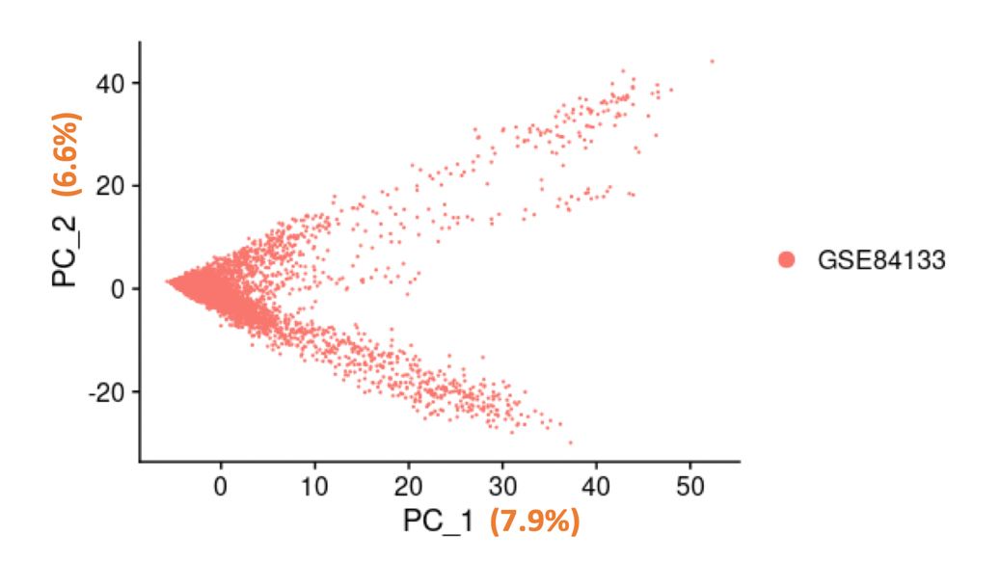
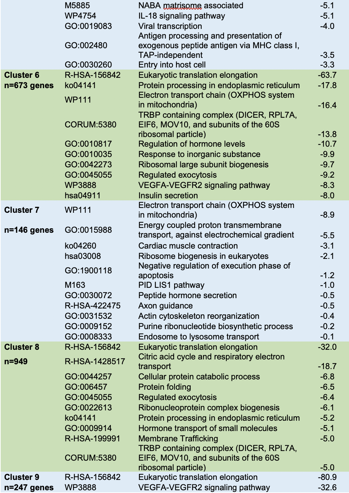

# Introduction

This repository is built to study the single cell RNA-Seq analysis of pancreatic cells based on the original publication by <em>Baron et al. (2016)</em>. The pancreas consists of a number of diverse cell types related to its endocrine and exocrine functions. The endocrine cell types serve to regulate blood glucose levels in fasted and fed states, while the exocrine cell types produce the gastric enzymes that break down food items in the small intestine. The endocrine cells make-up a small fraction of the entire cell population and become dysfunctional in diabetes. Most studies of the mechanisms of the pancreatic endocrine cells have been restricted to animal models, extrapolating the findings to diabetes in humans. However, key differences in the organization of the endocrine cells in the pancreas have been noted between humans and mice. Whether the differences in pancreatic histology are reflected by differences in the cell populations or transcriptomes of the pancreatic endocrine cells is not understood. Baron et al sought to compare the cell types present in human and mouse pancreatic samples using single cell transcriptomics, which we tried to recapitulate in our analyses using different methodologies.

# Samples

In this study by Baron et al, single cell sequencing was performed on approximately 10,000 human pancreatic cells collected at autopsy (N=4 donors) and approximately 10,000 murine pancreatic cells from 2 different mouse strains using inDrop.1, 4 inDrop encapsulates each of the individual cells within a single droplet containing all components needed for reverse transcription, converting the RNA to cDNA.4 Paired-end sequencing was performed with an Illumina Hiseq 2500 with an average of 100,000 reads per cell. 

In our analysis of the samples, in order to access a more convenient format for the barcode of each cell and UMIs of each transcript, 13 human single cell RNA-seq samples obtained from four donors were provided with preprocessed sequencing libraries. The barcodes in these samples were padded to be exactly 19 bases + 6 UMI bases = 25 bases. Out of the 13 given samples, we further investigated the samples from a 51 year old female donor (SRR3879604, SRR3879605, and SRR3879606) and performed cell-by-cell quantification of the UMI counts. 

# Methods

We used salmon alevin to map and quantify the reads, which we filtered for XXX. We used t-SNE to evaluate how the cells clustered based upon their transcriptomes, identified the differentially expressed genes that defined the clusters using K-nearest neighborhood (KNN) and assessed their biological significance with DAVID.

# Findings

Before the UMI counts were quantified, we evaluated the distribution of the reads among the barcodes. <b>Figure 1</b> shows a cumulative distribution of the barcode counts for all three samples. The majority of the barcodes had a very low frequency count (probably exactly 1 read per barcode). Therefore, to filter out these infrequent barcodes from each sample, we eliminate reads that aren’t met its respective mean value of all the barcode counts. The mean of the three samples are 279, 193, and 193 respectively. 

The barcodes that passed their average threshold were used in the quantification process with salmon alevin, an alignment tool for fast transcript quantification from single cell RNA-seq data.5 One helpful feature of salmon is that the salmon output contains statistics on how well the reads mapped to the reference genome. From the output log of salmon, we obtained a mapping rate of approximately 42.8%, which is quite low. After examining the quantification log, we found that ~3% reads are excluded due to noisy cellular barcodes, and 13,071 barcodes were skipped due to no mapped reads. Therefore, we suspect the high noise resulted in our low mapping rate.

</img>

<b>Figure 1</b>: Cumulative distribution of the barcode counts for the 51 year old female donor samples SRR3879604 (<b>A</b>), SRR3879605 (<b>B</b>), and SRR3879606 (<b>C</b>). The majority of the barcode counts for all three samples had a very low frequency (probably exactly 1 read per barcode). The infrequent barcodes were filtered out by their respective mean counts, 279, 193 and 193 respectively.  

After the samples were quantified with salmon, we obtained an UMI count matrix with 60,232 genes and 130,986 cells. To filter out the low-quality cells and genes for the downstream analysis, we utilized the Seurat package from Bioconductor to perform quality control on the UMI count matrix. First, we created a Seurat object of the UMI counts matrix and only the cells that had a minimum count of 10 and genes with a minimum count of 200 were retained. Our initial filter resulted in 21,495 genes and 10,059 cells. Next, we visualized the feature counts using a violin plot (<b>Figure 2</b>) to identify and exclude additional low-quality cells. Typically, a low-quality cell contains very few genes, and likewise, cell doublets or multiplets can exhibit an aberrantly high gene count. Therefore, by removing cells that have unique feature counts less than 200 and over 4000, we retained a total of 21,495 genes and 9,885 cells. Furthermore, if a cell is low-quality or dying, the cell will exhibits extensive mitochondrial contamination. Thus, we excluded cells that had >10% mitochondrial counts, leaving us with a final sample set of 21,495 genes and 2,685 cells. 

</img>

<b>Figure 2</b>: Violin plots were used to visualize the quality control metrics including the total number of freatures in a cell (<b>A</b>), total molecules detected within a cell (<b>B</b>), and the percent of reads that mapped to the mitochondrial genome (<b>C</b>) with the UMI counts matrix. The low-quality cells are filtered out by nFeature_RNA < 200 or nFeature_RNA > 4000 or percent.mt > 10%.

After we filtered the low-quality cells from the UMI counts matrix, we normalized the feature expression measurements for each cell by the total expression, then multiplied the normalized values by a scale factor of 10,000 and log-transformed the expression values. The normalization and log transformation reveals high cell-to-cell variation in transcript levels (i.e. gene transcripts that are highly expressed in some cells, and lowly expressed in others), aiding in the identification of differentially expressed genes. <b>Figure 3</b> shows the top 10 highly variable genes (REG1B, PRSS2, PLVAP, REG3A, CTRB2, PPY, REG1A, PRSS1, CTRB1 and ALB) that are outliers based upon the mean variability plot from Seurat. 

</img>

<b>Figure 3</b>: Top ten highly variable genes that are outliers based upon the mean variability plot from Seurat

We scaled the normalized expression of each gene so that the mean expression across cells was 0 and the variance was 1. Next, we performed PCA on the scaled data to determine which principal components (PCs) explained the most variation in the dataset. <b>Figure 4</b> shows the first two components of the PCA. The first PC explains about 7.9% of the variance while the second PC explained ~6.6% of the variance. <b>Figure 5</b> further shows an elbow plot, which ranks the PCs based on the percentage of variance explained by each PC. We observed an “elbow” around PC15, suggesting that the majority of the variance is explained by the first 15 PCs.

</img>

<b>Figure 4</b>: Dimension plot of the top two components of PCA. The 1PC explained ~7.9% of the overall variance while PC2 explained about 6.6% of the variance.

</img>

<b>Figure 5</b>: Elbow plot of the first 20 components of the PCA. The variance explained by the PCs are shown in descending order from the PCs explaining the greatest amount of the variation in the data to the PCs explaining the smallest amount of the variation. An “elbow” was observed around PC15, suggesting that the majority of the variance is explained by the first 15 PCs.

Once we knew the dimensionality of the data (15 PCs), we calculated the Euclidean distance in the PCA space and implemented a K-nearest neighbor (KNN) algorithm to cluster cells with similar feature expression patterns, partitioning the cells into highly interconnected communities. The KNN is a supervised machine learning algorithm that is used to solve both classification and regression problems. The KNN algorithm is based upon the premise that similar things exist in close proximity. After the cells were classified into their relative nearest neighborhood, we applied a modularity optimization technique known as the Louvain algorithm or SLM, to cluster the cells together. The Louvain method is an algorithm that is used for identifying communities in large networks. We obtained a total of 10 communities. The relative proportions of cell numbers identified within these 10 communities are reported in <b>Figure 6</b>.

</img>

<b>Figure 6</b>:  Relative proportions of cell numbers identified for each of the 10 communities using K-nearest neighborhood algorithm.

In order to identify pathways that were enriched by cell cluster, the differentially expressed genes for each cell cluster were filtered based upon a fold change >0 and an adjusted p-value of <0.05 and the resulting gene lists put into Metascape. The top pathways enriched for each cluster are presented in <b>Table X</b>. Gene enrichment using all of the differentially expressed genes defining each cluster resulted in very similar top enriched pathways as the filtered differentially expressed genes, which likely reflects the greater contribution of genes with higher fold changes and that are significant after adjusting for multiple testing driving the enrichment scores. 

<b>Table 2</b>: Gene Enrichment by Cluster
</img>
</img>
</img>

# Discussion

We sought to identify the potential cell type composition of each of the clusters we identified based upon their transcriptomes. The cells in cluster 0 expressed both SST and PPY, which define the delta and gamma cells, respectively. The pathway enrichment analysis for cluster 0 was non-specific with mitochondrial respiration and a response to hypoxia being the top pathways, which provides little additional information on the specific cell type of the cells belonging to this cluster. 

Cluster 1 likely contains beta cells as the cells in this cluster express insulin (INS) and have gene enrichment in the type 1 diabetes mellitus pathway, which would be expected to be enriched in beta cells, which become dysfunctional in diabetes. The cells belonging to cluster 6 are likely endocrine cells due to the enrichment of genes in insulin secretion and regulation of hormone levels. Of note, insulin was one of the differentially expressed genes defining cluster 6, suggesting that this cluster may also contain beta cells. Clusters 1 and 6 were both defined by the expression of insulin, indicative of beta cells, which is consistent with the findings of Baron et al who found heterogeneity in the gene expression patterns in the beta cells. Similar to the findings of the authors, cluster 6 cells had an enrichment in differentially expressed genes involved in pathways related to the endoplasmic reticulum and unfolded protein response that was not observed in the cluster 1 cells. 

Cluster 2 is a cell type that is responsive to hormonal regulation based upon the gene enrichment pathways, which indicate a response to peptide hormone and thermogenesis. Cluster 3 cells are likely exocrine cells due to the gene enrichment in protein digestion and absorption, which would be expected of cells that produce and secrete digestive enzymes. Consistent with this, CPA1 was a differentially expressed gene identified in cluster 3, which defines acinar cells. Based upon the gene enrichment in hormone pathways (regulation of hormone levels, peptide hormone metabolism, hormone metabolic process), cluster 4 cells are likely an endocrine cell type, although the enriched pathways provide little additional insight into which specific endocrine cell type. The cells in cluster 5 are also likely endocrine cells due to the enrichment of differentially expressed genes in gastrin signaling- gastrin is a hormone that stimulates cells in the stomach to produce and secrete acids and stimulates motility of the gastro-intestinal system. Interestingly, cluster 5 cells express KRT19, which is a ductal cell defining gene. 

Cluster 7 cells are likely a neuronal cell type, perhaps Schwann cells, due to their enrichment in genes in the neuronal development pathway PID LIS1 and axon guidance. Due to their enrichment for genes involved in hormone transport, it is possible that the cells in cluster 8 are involved in the endocrine functions of the pancreas. Cluster 9 cells may be endothelial cells due to the enrichment of genes in VEGFA-VEGFR2 signaling and blood vessel development. Cells in cluster 10 are likely ductal cells based upon their expression of KRT19 and the gene enrichment for epithelial cell differentiation. Cluster 11 cells expressed CPA1, which is a gene that’s expression defines acinar cells. Lastly, cluster 12 cells are likely immune cells due to their expression of genes enriched in leukocyte activation and immune system responses. Further, cluster 12 cells expressed SDS, which is a gene expressed specifically in macrophages. 

# Conclusion

# References

1.	Baron M, Veres A, Wolock SL, Faust AL, Gaujoux R, Vetere A, Ryu JH, Wagner BK, Shen-Orr SS, Klein AM, Melton DA and Yanai I. A Single-Cell Transcriptomic Map of the Human and Mouse Pancreas Reveals Inter- and Intra-cell Population Structure. Cell Syst. 2016;3:346-360 e4.

2.	Huang da W, Sherman BT and Lempicki RA. Systematic and integrative analysis of large gene lists using DAVID bioinformatics resources. Nat Protoc. 2009;4:44-57.

3.	Laurens van der Maaten GH. Visulazing Data with t-SNE. Journal of Machine Learning Research. 2008;9:2579-2605.

4.	Klein AM, Mazutis L, Akartuna I, Tallapragada N, Veres A, Li V, Peshkin L, Weitz DA and Kirschner MW. Droplet barcoding for single-cell transcriptomics applied to embryonic stem cells. Cell. 2015;161:1187-1201.

5.	Patro R, Duggal G, Love MI, Irizarry RA and Kingsford C. Salmon provides fast and bias-aware quantification of transcript expression. Nat Methods. 2017;14:417-419.

6.	Zhou Y, Zhou B, Pache L, Chang M, Khodabakhshi AH, Tanaseichuk O, Benner C and Chanda SK. Metascape provides a biologist-oriented resource for the analysis of systems-level datasets. Nat Commun. 2019;10:1523.

7. Macosko et al. Highly Parallel Genome-wide Expression Profiling of Individual Cells Using Nanoliter Droplets. Cell. 2015;161;1202–1214; doi: https://doi.org/10.1016/j.cell.2015.05.002

8. Hao Y, Hao S, Andersen-Nissen E, III WMM, Zheng S, Butler A, Lee MJ, Wilk AJ, Darby C, Zagar M, Hoffman P, Stoeckius M, Papalexi E, Mimitou EP, Jain J, Srivastava A, Stuart T, Fleming LB, Yeung B, Rogers AJ, McElrath JM, Blish CA, Gottardo R, Smibert P, Satija R (2020). “Integrated analysis of multimodal single-cell data.” bioRxiv. doi: 10.1101/2020.10.12.335331, https://doi.org/10.1101/2020.10.12.335331.

9. Stuart T, Butler A, Hoffman P, Hafemeister C, Papalexi E, III WMM, Hao Y, Stoeckius M, Smibert P, Satija R (2019). “Comprehensive Integration of Single-Cell Data.” Cell, 177, 1888-1902. doi: 10.1016/j.cell.2019.05.031, https://doi.org/10.1016/j.cell.2019.05.031.

10. Butler A, Hoffman P, Smibert P, Papalexi E, Satija R (2018). “Integrating single-cell transcriptomic data across different conditions, technologies, and species.” Nature Biotechnology, 36, 411-420. doi: 10.1038/nbt.4096, https://doi.org/10.1038/nbt.4096.

11. Satija R, Farrell JA, Gennert D, Schier AF, Regev A (2015). “Spatial reconstruction of single-cell gene expression data.” Nature Biotechnology, 33, 495-502. doi: 10.1038/nbt.3192, https://doi.org/10.1038/nbt.3192.

# Resources

### Code

<b>Snakefile</b> is a file that used to count reads among the barcodes. The file is located at <b>/projectnb/bf528/users/wheeler/project_4</b>

<b>run_salmon_index.qsub</b> is an bash script that creates a salmon index that will be used in the quantification process later. It is stored at <b>/projectnb/bf528/users/wheeler/project_4</b>

<b>run_salmon_alevin.qsub</b> is an bash script that is used to map and quantify the reads. The file is located at <b>/projectnb/bf528/users/wheeler/project_4</b>

<b>data_curator.R</b> is an R script that runs the analysis for data curator and programmer parts such as doing quality control on the UMI count matrix, PCA of normalized feature expression values and cell clustering with KNN. It is stored at <b>/projectnb/bf528/users/wheeler/project_4</b>

<b>biologist_DEGs.R</b> is an R script that filters the differentially expressed genes for each individual cluster based upon a log fold change greater than 0 and adjusted p-value of less than 0.05. The script also prints the list of filtered genes for each cluster on a new line to make it easy to paste into gene enrichment tools. It is stored at <b>/projectnb/bf528/users/wheeler/project_4</b>

### Output 

UMI counts matrix for the 51 years old female donor samples (SRR3879604, SRR3879605, and SRR3879606) in the form of salmon alevin output are stored in <b>/projectnb/bf528/users/wheeler/project_4/samples/salmon_alevin_output</b> directory

# Contributors

<strong>Curator:</strong> Vishala Mishra (continue to be absent)  
<strong>Programmer:</strong> Reina Chau (RC-88) 
<strong>Analyst:</strong> Ariel Xue (arial208x) J 
<strong>Biologist:</strong> Jessica Fetterman (jessicalfetterman) 

  
